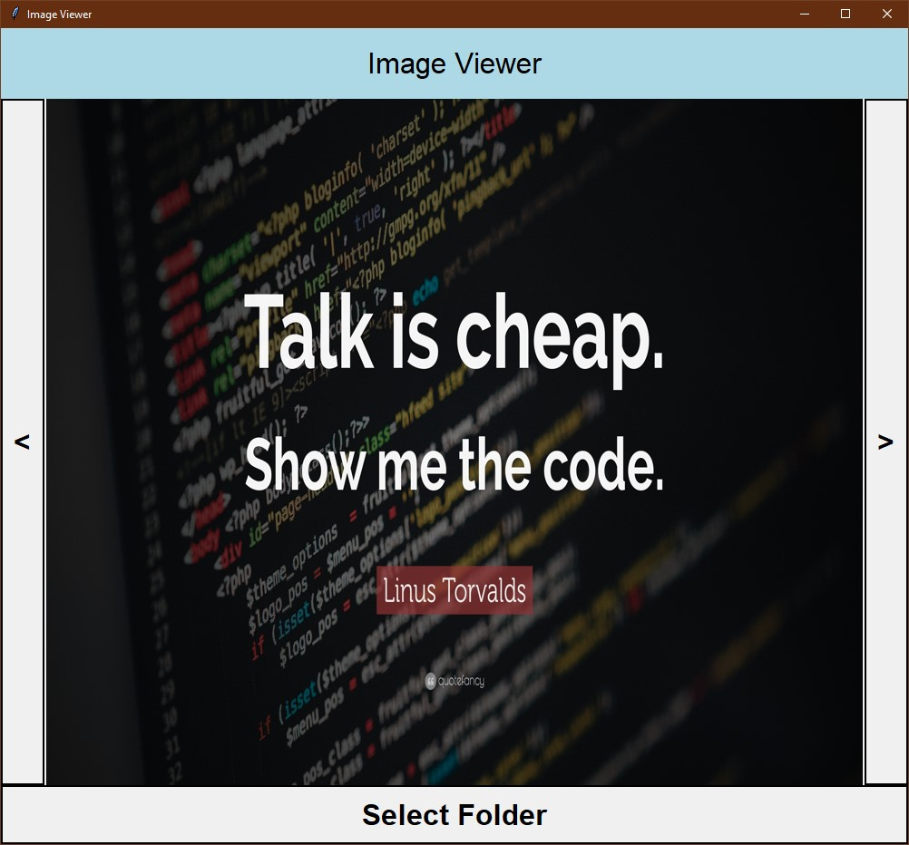

# Image Viewer 
A Simple Image Viewer GUI in Python made using `tkinter` and `pillow` library.



## Software & libraires used:
- Python 3.10.2
- Pillow==9.2.0

### Clone this repository
```
git clone https://github.com/Param302/Image-Viewer.git
```

### Setup
- Make sure to install pillow library
```
python -m pip install -r requirements.txt
```
- Run `main.py` file
```
python main.py
```
